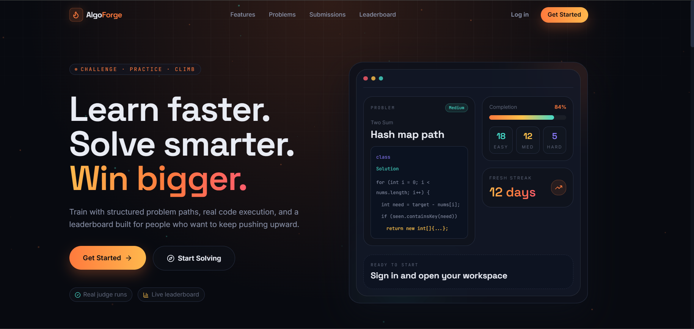
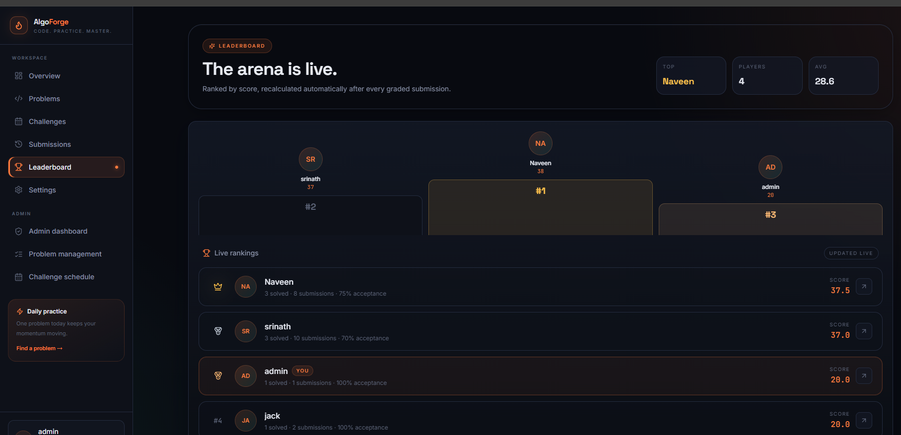
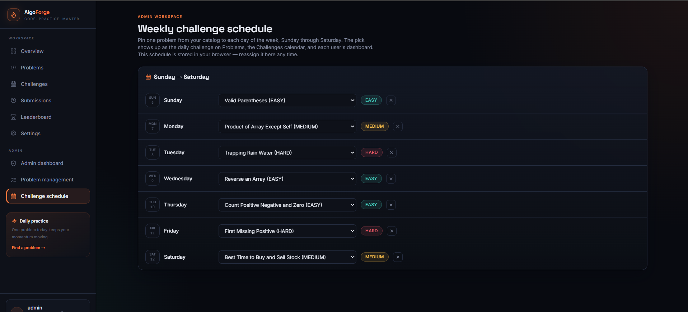

# AlgoForge

> A full-stack coding-practice platform for solving algorithm problems, receiving secure code-execution results, tracking progress, and competing on a leaderboard.


AlgoForge brings the core coding-platform workflow into one place: discover a problem, write and run code in the browser, submit against hidden tests, and review your progress over time.



## Quick start

The fastest local setup is:

```powershell
# Terminal 1: database
cd coding-platform-backend
docker compose up -d postgres

# Terminal 2: API
cd coding-platform-backend
$env:DB_PASSWORD = "1234"
$env:JWT_SECRET = "replace-this-with-a-long-random-secret"
$env:SPRING_PROFILES_ACTIVE = "demo"
mvn spring-boot:run

# Terminal 3: web app
cd algoforge-frontend
npm install
Copy-Item .env.example .env -ErrorAction SilentlyContinue
npm run dev
```

Open `http://localhost:5173`. The API is available at `http://localhost:8080`.

When the `demo` profile is enabled, use the seeded admin account for local exploration:

| Username | Password |
| --- | --- |
| `admin` | `Admin@123` |

These credentials are for local demo use only. Do not use them in a deployed environment.

## Contents

- [What AlgoForge provides](#highlights)
- [Architecture](#system-architecture)
- [Repository layout](#repository-layout)
- [Technology stack](#technology-stack)
- [Run locally](#run-locally)
- [REST API](#rest-api)
- [Security model](#security-model)
- [Testing and build](#testing-and-build)
- [Configuration reference](#configuration-reference)
- [Troubleshooting](#troubleshooting)
- [Roadmap](#roadmap)

| Quick links | |
| --- | --- |
| Project report | [Download the Infosys Springboard internship report](docs/InfosysSpringboardInternshipReport.docx) |
| Screenshots | [Browse the project screenshots](docs/screenshots/) |
| Frontend | [`algoforge-frontend/`](algoforge-frontend/) |
| Backend API | [`coding-platform-backend/`](coding-platform-backend/) |

> GitHub does not preview this Word file because of its size. Open the report link above and choose **Download raw** to view it locally.

The platform is built as a modular React + Spring Boot application with PostgreSQL, Flyway schema migrations, JWT authentication, and Docker-based code execution.

## Highlights

- Solve problems in Java, Python, C++, and JavaScript
- Run sample tests or submit against visible and hidden judge cases
- Docker-isolated code execution with network, memory, CPU, PID, and filesystem limits
- JWT authentication and role-based user/admin access
- Admin problem and test-case management
- Weekly challenges shared across every user and device
- Dashboard, activity graph, profile, submissions, and leaderboard
- Responsive workspace with independently scrollable problem and editor panels on desktop

## Screenshots

The interface is organized around repeated practice: choose a problem, work in the editor, inspect results, and follow progress from the dashboard.

<p>
        
        
        
</p>

See the complete [screenshot collection](docs/screenshots/) for additional screens.

## System architecture

```text
React + Vite frontend (localhost:5173)
        |
        | HTTP / REST + JWT (local development)
        v
Spring Boot REST API (localhost:8080)
        |                 |
        v                 v
PostgreSQL + Flyway   Docker execution sandbox
```

## Repository layout

```text
AlgoForge/
├── algoforge-frontend/        # React + TypeScript user interface
├── coding-platform-backend/   # Spring Boot REST API and execution service
├── docs/                      # Project documentation, report, and screenshots
├── README.md                  # Setup, architecture, API, and operations guide
└── .gitignore                 # Local build, secret, and runtime exclusions
```

### Frontend

`algoforge-frontend/` is a React 18 + TypeScript application powered by Vite.

- `src/pages/` — application routes and feature screens
- `src/components/` — reusable UI, dashboard, landing, and challenge components
- `src/lib/services/` — typed REST API clients
- `src/store/` — Zustand authentication and theme state
- `src/types/` — frontend API contracts

### Backend

`coding-platform-backend/` is a Java 17 Spring Boot API.

- `auth/` — registration and login
- `security/` — JWT authentication, roles, and route protection
- `problem/` and `testcase/` — problem catalog and judge test cases
- `submission/`, `submissionresult/`, and `execution/` — grading workflow
- `docker/` — isolated compile/run container management
- `dashboard/`, `leaderboard/`, and `challenge/` — learner progress and competition features
- `user/` — profile and admin user management
- `resources/db/migration/` — versioned Flyway database migrations

### Database

PostgreSQL stores users, roles, problems, test cases, submissions, submission results, leaderboard data, and weekly challenges. Flyway applies database changes in order whenever the backend starts.

## Technology stack

| Layer | Technology |
| --- | --- |
| Frontend | React 18, TypeScript, Vite, Tailwind CSS, React Query, Zustand, Monaco Editor |
| Backend | Java 17, Spring Boot 3, Spring Security, Spring Data JPA |
| Database | PostgreSQL, Flyway |
| Code execution | Docker, Java, Python, C++, Node.js |
| API documentation | Swagger UI / OpenAPI |

## Run locally

### Prerequisites

- Node.js 20+
- Java 17+
- Maven 3.9+
- Docker Desktop (running)

### 1. Start PostgreSQL

```powershell
cd coding-platform-backend
docker compose up -d postgres
```

### 2. Start the backend

```powershell
cd coding-platform-backend
$env:DB_PASSWORD = "1234"
$env:JWT_SECRET = "replace-this-with-a-long-random-secret"
$env:SPRING_PROFILES_ACTIVE = "demo"  # local demo problems/admin only
mvn spring-boot:run
```

The API runs at `http://localhost:8080`.

### 3. Start the frontend

Open another terminal:

```powershell
cd algoforge-frontend
npm install
Copy-Item .env.example .env -ErrorAction SilentlyContinue
npm run dev
```

Open `http://localhost:5173`.

Set `VITE_API_BASE_URL=http://localhost:8080` in `algoforge-frontend/.env` when needed.

### Optional: run the complete stack with Docker Compose

The backend Compose service also builds and runs the API. It mounts the host Docker socket so submitted programs can launch isolated execution containers:

```powershell
cd coding-platform-backend
docker compose up --build
```

Use this option when Docker Desktop is available and you want the API and database managed together. The frontend still runs separately with `npm run dev`.

## REST API

- Swagger UI: `http://localhost:8080/swagger-ui.html`
- OpenAPI JSON: `http://localhost:8080/v3/api-docs`

Send authenticated requests with:

```http
Authorization: Bearer <JWT_TOKEN>
```

| Area | Endpoints | Access |
| --- | --- | --- |
| Authentication | `POST /api/auth/register`, `POST /api/auth/login` | Public |
| Problems | `GET /api/problems`, `GET /api/problems/{id}` | Public |
| Problem administration | `POST/PUT/DELETE /api/problems` | Admin |
| Test cases | `GET /api/problems/{id}/testcases` | Public, visible cases only |
| Test-case administration | `GET /all`, `POST`, `PUT`, `DELETE /api/problems/{id}/testcases...` | Admin only |
| Submissions | `POST /api/submissions`, `GET /api/submissions/me`, `GET /api/submissions/{id}`, `GET /api/submissions/{id}/results`, `GET /api/submissions/me/solved-problems` | Authenticated |
| Hints/editorial | `GET /api/problems/{id}/hints`, `/editorial` | Authenticated |
| Dashboard | `GET /api/dashboard`, `/api/dashboard/activity` | Authenticated |
| Challenges | `GET /api/challenges/weekly` | Authenticated |
| Challenge administration | `PUT/DELETE /api/challenges/weekly/{dayOfWeek}` | Admin |
| Users | `GET /api/users/me`, `GET /api/users/me/dashboard`, `PUT /api/users/me/profile` | Authenticated |
| User administration | `GET /api/admin/users` | Admin |
| Leaderboard | `GET /api/leaderboard` | Public |

`POST /api/submissions` supports both actions: use `sampleRunOnly: true` for a sample run or `false` for an official submission.

## Security model

- Passwords are hashed through Spring Security.
- JWT secures authenticated routes.
- Admin endpoints require the `ADMIN` role in both the frontend and backend.
- Hidden test cases are never returned by public problem endpoints.
- Execution containers use disabled network access, a read-only root filesystem, an unprivileged user, memory/CPU/PID limits, and execution timeouts.
- Demo data is restricted to the `demo` profile; do not use it in production.

## Testing and build

```powershell
# Frontend
cd algoforge-frontend
npm run build

# Backend
cd coding-platform-backend
mvn test
mvn package
```

Run the backend tests without Docker execution:

```powershell
cd coding-platform-backend
mvn test "-Dspring.profiles.active=test"
```

The backend test profile uses an in-memory H2 database and disables Flyway and Docker execution:

## Database and Flyway workflow

The backend applies SQL migrations from `coding-platform-backend/src/main/resources/db/migration/` during startup. Migration files use `V<version>__<description>.sql`; Flyway records completed migrations in the `flyway_schema_history` table.

To change the schema, add a new next-numbered, forward-only migration and commit it with its matching Java changes. Do not edit a migration that may already have been applied by another environment.

For an intentionally fresh local database only:

```powershell
cd coding-platform-backend
docker compose down -v
docker compose up -d postgres
```

`docker compose down -v` deletes the local PostgreSQL volume, so do not use it when the database contains data you need.

## Configuration reference

| Setting | Default | Notes |
| --- | --- | --- |
| `VITE_API_BASE_URL` | `http://localhost:8080` | Frontend API address; restart Vite after changing `.env`. |
| `DB_PASSWORD` | `1234` | Must match the PostgreSQL Compose password. |
| `JWT_SECRET` | development fallback | Always set a long, unique value outside local development. |
| `DOCKER_EXECUTION_ENABLED` | `true` | Set `false` to start the API without the code runner. |
| `APP_CORS_ALLOWED_ORIGINS` | local Vite origins | Comma-separated allowed browser origins. |

## Troubleshooting

| Symptom | Resolution |
| --- | --- |
| Backend cannot connect to PostgreSQL | Run `docker compose ps`; confirm PostgreSQL is healthy and `DB_PASSWORD` is `1234` (or matches your override). |
| Frontend cannot call the API | Check that the API is running on port 8080 and `VITE_API_BASE_URL` is correct. |
| Browser shows a CORS error | Add the browser origin/port to `APP_CORS_ALLOWED_ORIGINS`. |
| A submission does not run | Start Docker Desktop and confirm `DOCKER_EXECUTION_ENABLED` is not `false`. |
| Flyway reports a local migration failure | Inspect backend logs and `flyway_schema_history`; recreate the database volume only if data loss is acceptable. |

## Git workflow

This local repository is connected to:

`https://github.com/Srinath2786/AlgoForge`

Use feature branches and pull the remote branch before pushing when Git reports a non-fast-forward rejection:

```powershell
git fetch origin
git pull --rebase origin main
git push -u origin main
```

Resolve any conflicts before continuing the rebase. Never force-push unless you understand which remote commits would be replaced.

## Roadmap

- Structured DSA learning paths and spaced revision
- Private notes and bookmarks
- Personalized recommendations and failure analysis
- Timed contests and private classroom/company rooms
- Queue-based judge workers for larger-scale execution

## License

No license has been selected yet. Add a `LICENSE` file before publishing the project for public reuse.
