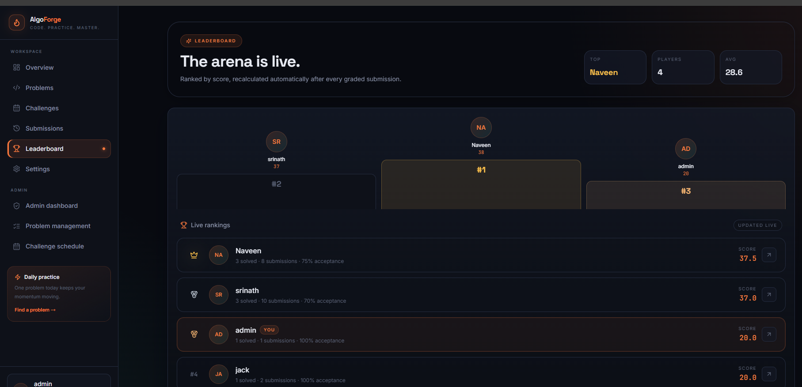
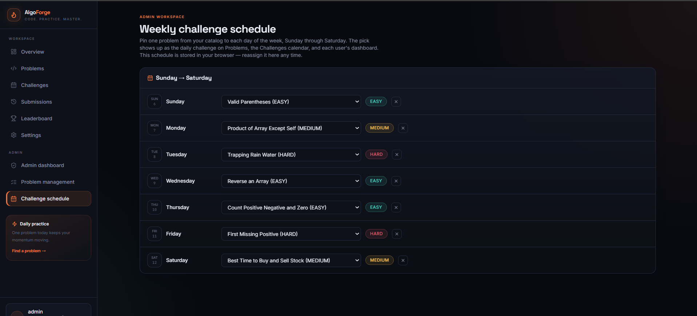

# ⚡ AlgoForge

### Full-Stack Coding Practice & Performance Assessment Platform

> **Practice. Code. Submit. Improve.**

AlgoForge is a full-stack coding practice platform designed to provide a structured environment for solving algorithmic problems, running code, submitting solutions against hidden test cases, tracking performance, and competing through leaderboards.

Built with **React, TypeScript, Spring Boot, PostgreSQL, Docker, and JWT authentication**, AlgoForge brings the essential coding-platform workflow into a single modern web application.

---

## ✨ Overview

AlgoForge provides an end-to-end coding practice experience:

```text
Discover Problem
       ↓
Read Problem Statement
       ↓
Write Code in Browser
       ↓
Run Sample Tests
       ↓
Submit Solution
       ↓
Hidden Test Evaluation
       ↓
View Submission Result
       ↓
Track Progress
       ↓
Compete on Leaderboard
```

The platform supports multiple programming languages and uses Docker-based isolated execution for submitted programs.

---

## 🚀 Key Features

### 👨‍💻 Coding Practice

* Browse algorithm and programming problems
* View problem statements and test cases
* Write code directly in the browser
* Monaco-based code editor
* Run sample test cases
* Submit solutions for official evaluation
* Receive execution and grading results

### 🧪 Online Judge

AlgoForge provides two submission modes:

| Mode                    | Purpose                                                     |
| ----------------------- | ----------------------------------------------------------- |
| **Sample Run**          | Quickly test code against sample cases                      |
| **Official Submission** | Evaluate the solution against visible and hidden test cases |

The platform keeps hidden test cases protected from normal users while using them for server-side evaluation.

### 🐳 Secure Code Execution

Submitted programs are executed inside Docker-based isolated environments.

The execution system supports:

* Network restrictions
* Memory limits
* CPU limits
* PID limits
* Execution timeouts
* Read-only filesystem
* Unprivileged execution user

This provides an additional isolation layer between submitted code and the host environment.

### 🔐 Authentication & Authorization

* User registration
* User login
* JWT-based authentication
* Protected API endpoints
* Role-based authorization
* Admin-only operations
* Secure password hashing

### 🛠️ Admin Management

Administrators can manage:

* Problems
* Test cases
* Users
* Weekly challenges
* Problem content
* Hidden judge data

### 📊 Dashboard

Users can track their coding activity through:

* Problem-solving progress
* Activity history
* Solved problems
* Submission information
* Profile information
* Performance statistics

### 🏆 Leaderboard

AlgoForge includes a public leaderboard that allows users to compare their coding progress and performance with other platform users.

### 📅 Weekly Challenges

The platform supports weekly challenges shared across users and devices, providing a structured way to practice consistently.

### 📱 Responsive Workspace

The coding workspace is designed around a practical split layout:

```text
┌──────────────────────────────────────────────────────┐
│                    AlgoForge                         │
├───────────────────────┬──────────────────────────────┤
│                       │                              │
│   Problem Statement   │       Code Editor            │
│                       │                              │
│   Examples            │       Monaco Editor          │
│                       │                              │
│   Constraints         │                              │
│                       │                              │
├───────────────────────┴──────────────────────────────┤
│              Run / Submit / Results                  │
└──────────────────────────────────────────────────────┘
```

---

## 🖥️ Screenshots

### Dashboard



### Coding Workspace



### Leaderboard


Additional screenshots are available in:

```text
docs/screenshots/
```

---

# 🏗️ System Architecture

AlgoForge follows a modular full-stack architecture.

```text
                     ┌───────────────────────┐
                     │      User Browser     │
                     │                       │
                     │ React + TypeScript    │
                     │ Vite + Monaco Editor  │
                     └───────────┬───────────┘
                                 │
                              HTTP/REST
                              + JWT
                                 │
                                 ▼
                     ┌───────────────────────┐
                     │    Spring Boot API    │
                     │                       │
                     │ Authentication        │
                     │ Problems              │
                     │ Submissions           │
                     │ Dashboard             │
                     │ Challenges            │
                     │ Leaderboard           │
                     │ Users                 │
                     └───────┬─────────┬─────┘
                             │         │
                    ┌────────▼───┐ ┌──▼──────────────┐
                    │ PostgreSQL │ │ Docker Sandbox  │
                    │            │ │                │
                    │ Flyway     │ │ Code Execution │
                    │ Migrations │ │ & Evaluation   │
                    └────────────┘ └─────────────────┘
```

### Application Flow

```text
Frontend
   │
   │ REST API + JWT
   ▼
Spring Boot
   │
   ├── Authentication
   ├── Problem Management
   ├── Submission Management
   ├── Judge / Execution
   ├── Dashboard
   ├── Challenges
   └── Leaderboard
   │
   ├──────────────► PostgreSQL
   │
   └──────────────► Docker Execution Sandbox
```

---

# 🛠️ Technology Stack

## Frontend

* React 18
* TypeScript
* Vite
* Tailwind CSS
* React Query
* Zustand
* Monaco Editor

## Backend

* Java 17
* Spring Boot 3
* Spring Security
* Spring Data JPA
* Maven

## Database

* PostgreSQL
* Flyway

## Code Execution

* Docker
* Java
* Python
* C++
* Node.js

## API

* REST API
* JWT Authentication
* Swagger UI
* OpenAPI

The documented stack uses React 18/TypeScript on the frontend and Java 17/Spring Boot 3 on the backend.

---

# 📂 Project Structure

```text
AlgoForge/
│
├── algoforge-frontend/
│   │
│   ├── src/
│   │   ├── components/
│   │   ├── pages/
│   │   ├── lib/
│   │   │   └── services/
│   │   ├── store/
│   │   └── types/
│   │
│   ├── .env.example
│   └── package.json
│
├── coding-platform-backend/
│   │
│   ├── src/
│   │   ├── main/
│   │   │   ├── java/
│   │   │   │   └── ...
│   │   │   └── resources/
│   │   │       └── db/
│   │   │           └── migration/
│   │   │
│   │   └── test/
│   │
│   ├── docker/
│   ├── pom.xml
│   └── docker-compose.yml
│
├── docs/
│   ├── screenshots/
│   └── InfosysSpringboardInternshipReport.docx
│
├── README.md
└── .gitignore
```

---

# 🎨 Frontend Architecture

The frontend is a React + TypeScript application powered by Vite.

### Main areas

```text
src/
│
├── components/
│   ├── Dashboard
│   ├── Landing
│   ├── Workspace
│   └── Challenge components
│
├── pages/
│   └── Application screens
│
├── lib/
│   └── services/
│       └── REST API clients
│
├── store/
│   └── Authentication & theme state
│
└── types/
    └── API contracts
```

The application uses Zustand for client-side authentication/theme state and React Query for API-related data management.

---

# ⚙️ Backend Architecture

The Spring Boot backend is organized into modular feature areas.

```text
Backend
│
├── auth/
│   └── Registration & Login
│
├── security/
│   └── JWT & Role Authorization
│
├── problem/
│   └── Problem Management
│
├── testcase/
│   └── Judge Test Cases
│
├── submission/
│   └── Submission Workflow
│
├── submissionresult/
│   └── Evaluation Results
│
├── execution/
│   └── Code Execution
│
├── docker/
│   └── Isolated Containers
│
├── dashboard/
│   └── User Progress
│
├── leaderboard/
│   └── Rankings
│
├── challenge/
│   └── Weekly Challenges
│
├── user/
│   └── User & Profile Management
│
└── resources/db/migration/
    └── Flyway Database Migrations
```

---

# 🗄️ Database

PostgreSQL is used as the primary relational database.

The database stores information related to:

* Users
* Roles
* Problems
* Test cases
* Submissions
* Submission results
* Leaderboard information
* Weekly challenges

Flyway manages database schema changes through versioned migrations.

```text
Application Start
       ↓
Flyway
       ↓
Check Migration History
       ↓
Apply Pending Migrations
       ↓
Spring Boot Application
```

Migration files follow the format:

```text
V<version>__<description>.sql
```

For example:

```text
V1__initial_schema.sql
V2__add_submission_results.sql
V3__add_weekly_challenges.sql
```

> Existing migrations should not be edited after they have been applied to an environment. Add a new migration for future schema changes.

---

# 🔐 Security

Security is an important part of AlgoForge.

### Authentication

```text
User
 │
 ├── Register
 │
 └── Login
       │
       ▼
   Spring Security
       │
       ▼
    JWT Token
       │
       ▼
Authenticated API Requests
```

### Security features

* Password hashing through Spring Security
* JWT authentication
* Protected API routes
* Role-based authorization
* Admin-only endpoints
* Hidden test-case protection
* Docker execution isolation

### Hidden Test Cases

Normal users can access visible problem information, but hidden judge cases are not exposed through public problem APIs.

This allows the backend to evaluate official submissions without revealing the complete test suite.

---

# 🐳 Docker Code Execution

One of AlgoForge's core components is its isolated code execution workflow.

```text
User submits code
       │
       ▼
Spring Boot API
       │
       ▼
Submission Service
       │
       ▼
Docker Execution Manager
       │
       ▼
Isolated Container
       │
       ├── Compile
       ├── Execute
       ├── Apply limits
       └── Capture result
       │
       ▼
Submission Result
       │
       ▼
Frontend
```

Execution environments apply restrictions including:

* Disabled network access
* Memory limits
* CPU limits
* PID limits
* Execution timeouts
* Read-only root filesystem
* Unprivileged execution

This execution model is intended to provide isolation for submitted programs.

---

# 🌐 REST API

The backend exposes REST endpoints for the major platform features.

### Authentication

```http
POST /api/auth/register
POST /api/auth/login
```

### Problems

```http
GET /api/problems
GET /api/problems/{id}
```

### Submissions

```http
POST /api/submissions
GET /api/submissions/me
GET /api/submissions/{id}
GET /api/submissions/{id}/results
GET /api/submissions/me/solved-problems
```

### Dashboard

```http
GET /api/dashboard
GET /api/dashboard/activity
```

### Challenges

```http
GET /api/challenges/weekly
```

### User

```http
GET /api/users/me
GET /api/users/me/dashboard
PUT /api/users/me/profile
```

### Leaderboard

```http
GET /api/leaderboard
```

### Admin

```http
GET /api/admin/users
```

Additional problem and test-case administration endpoints are available for administrators.

---

# 📚 API Documentation

Swagger UI:

```text
http://localhost:8080/swagger-ui.html
```

OpenAPI specification:

```text
http://localhost:8080/v3/api-docs
```

Authenticated API requests use:

```http
Authorization: Bearer <JWT_TOKEN>
```

---

# 🚀 Getting Started

## Prerequisites

Install the following before starting AlgoForge:

* Node.js 20+
* Java 17+
* Maven 3.9+
* Docker Desktop
* Git

Verify your installations:

```powershell
node --version
java --version
mvn --version
docker --version
git --version
```

---

# 1️⃣ Clone the Repository

```powershell
git clone https://github.com/Srinath2786/AlgoForge.git
cd AlgoForge
```

---

# 2️⃣ Start PostgreSQL

Navigate to the backend:

```powershell
cd coding-platform-backend
```

Start PostgreSQL:

```powershell
docker compose up -d postgres
```

Check the running containers:

```powershell
docker compose ps
```

---

# 3️⃣ Configure the Backend

Set the required environment variables:

```powershell
$env:DB_PASSWORD = "1234"
$env:JWT_SECRET = "replace-this-with-a-long-random-secret"
$env:SPRING_PROFILES_ACTIVE = "demo"
```

> For real deployments, always use a strong unique JWT secret and secure database credentials.

---

# 4️⃣ Start the Backend

From:

```text
AlgoForge/coding-platform-backend
```

run:

```powershell
mvn spring-boot:run
```

The API will be available at:

```text
http://localhost:8080
```

---

# 5️⃣ Start the Frontend

Open a new terminal:

```powershell
cd algoforge-frontend
```

Install dependencies:

```powershell
npm install
```

Create the environment file:

```powershell
Copy-Item .env.example .env -ErrorAction SilentlyContinue
```

Set:

```env
VITE_API_BASE_URL=http://localhost:8080
```

Start the development server:

```powershell
npm run dev
```

Open:

```text
http://localhost:5173
```

---

# 🔑 Demo Account

When running with the `demo` Spring profile, the local demo account is:

```text
Username: admin
Password: Admin@123
```

⚠️ **Do not use these credentials in a deployed production environment.**

---

# 🐳 Run the Complete Backend Stack with Docker

If you want Docker Compose to build and run the API and database:

```powershell
cd coding-platform-backend
docker compose up --build
```

The frontend continues to run separately:

```powershell
cd algoforge-frontend
npm run dev
```

---

# 🧪 Testing

## Frontend Build

```powershell
cd algoforge-frontend
npm run build
```

## Backend Tests

```powershell
cd coding-platform-backend
mvn test
```

## Backend Package

```powershell
mvn package
```

## Test Without Docker Execution

The test profile uses an in-memory H2 database and disables Flyway/Docker execution:

```powershell
mvn test "-Dspring.profiles.active=test"
```

---

# 🔧 Configuration

### Frontend

```env
VITE_API_BASE_URL=http://localhost:8080
```

### Backend

| Variable                   | Purpose                       |
| -------------------------- | ----------------------------- |
| `DB_PASSWORD`              | PostgreSQL password           |
| `JWT_SECRET`               | JWT signing secret            |
| `DOCKER_EXECUTION_ENABLED` | Enable/disable code execution |
| `APP_CORS_ALLOWED_ORIGINS` | Allowed frontend origins      |

Example:

```powershell
$env:DB_PASSWORD = "1234"
$env:JWT_SECRET = "your-long-random-secret"
$env:DOCKER_EXECUTION_ENABLED = "true"
```

---

# 🛠️ Troubleshooting

### PostgreSQL connection error

Check Docker:

```powershell
docker compose ps
```

Make sure PostgreSQL is running and the configured password matches the Compose configuration.

### Frontend cannot connect to backend

Verify:

```text
Backend:
http://localhost:8080

Frontend:
http://localhost:5173
```

Check:

```env
VITE_API_BASE_URL=http://localhost:8080
```

Restart Vite after changing `.env`.

### CORS error

Verify that the frontend origin is included in:

```text
APP_CORS_ALLOWED_ORIGINS
```

### Submission does not execute

Make sure:

1. Docker Desktop is running.
2. Docker execution is enabled.
3. The backend can access the Docker environment.

```powershell
docker ps
```

### Flyway migration error

Inspect:

```text
flyway_schema_history
```

Only recreate the local database volume when you are certain that existing local data can be deleted.

---

# 🧭 Development Workflow

A typical development workflow is:

```text
Create Feature
     ↓
Create Feature Branch
     ↓
Implement Changes
     ↓
Run Frontend Build
     ↓
Run Backend Tests
     ↓
Test API
     ↓
Test UI
     ↓
Commit Changes
     ↓
Push Branch
     ↓
Create Pull Request
```

Recommended Git workflow:

```powershell
git fetch origin
git pull --rebase origin main
git push -u origin main
```

Avoid force-pushing unless you understand exactly which remote commits would be replaced.

---

# 📈 Future Roadmap

Planned improvements include:

* Structured DSA learning paths
* Spaced-revision support
* Private notes
* Problem bookmarks
* Personalized recommendations
* Failure analysis
* Timed contests
* Private classroom rooms
* Company-specific practice rooms
* Queue-based judge workers for larger-scale execution

These roadmap items are future directions and are not presented as currently implemented features.

---

# 📄 Project Documentation

The repository includes project documentation and screenshots:

```text
docs/
├── screenshots/
└── InfosysSpringboardInternshipReport.docx
```

The project report can be found at:

```text
docs/InfosysSpringboardInternshipReport.docx
```

---

# 🎓 Project Context

**AlgoForge** was developed as part of the **Infosys Springboard Internship 7.0** project work.

The project focuses on building a practical coding-practice and performance-assessment platform with:

* Full-stack web development
* REST API development
* Authentication and authorization
* Database management
* Code execution
* Hidden test evaluation
* User progress tracking
* Leaderboard functionality

---

# 👨‍💻 Author

### Srinath M

**Java Full-Stack Developer | Backend Developer**

GitHub:
https://github.com/Srinath2786

LinkedIn:
https://www.linkedin.com/in/srinathm-java/

Portfolio:
https://srinathcse.netlify.app/

---

# ⭐ Repository

If you find AlgoForge useful or interesting, consider giving the repository a ⭐.

```text
https://github.com/Srinath2786/AlgoForge
```

---

# 📜 License

No license has currently been selected for this repository.

If you intend to allow public reuse, add an appropriate `LICENSE` file before publishing the project for reuse.

---

## ⚡ AlgoForge

```text
Practice smarter.
Write better code.
Solve more problems.
```
